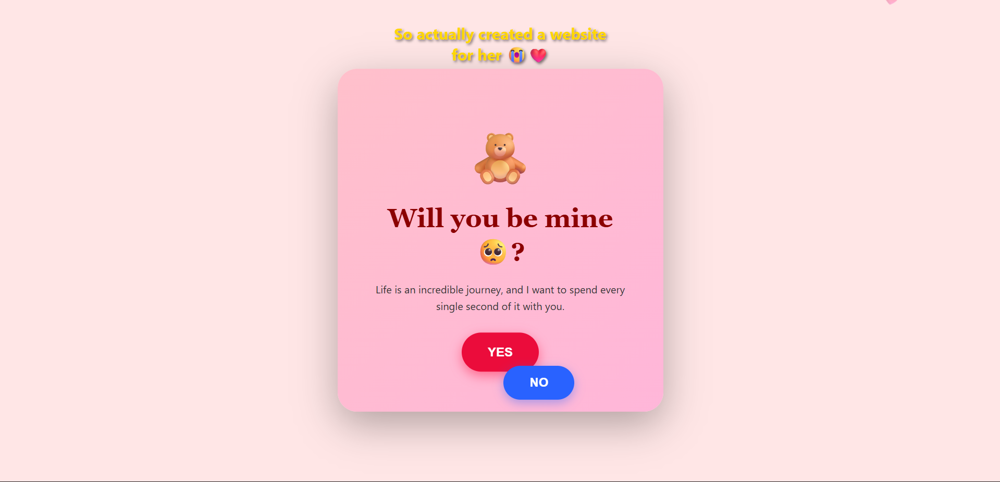

<div align="center">

# 💖 Valentine Interactive Website

### A Romantic & Interactive Valentine Experience Built With Pure Frontend Magic ✨

<p align="center">
  An immersive Valentine-themed website featuring romantic animations, interactive surprises, love quizzes, music, emotional storytelling, and modern UI effects.
</p>

<br/>


<br/>

[🌐 Live Demo](https://valentine-website-eight-taupe.vercel.app/) • 
[💻 GitHub Repository](https://github.com/Deepak-tech06/valentine-website)

</div>

---

# 📸 Preview

<p align="center">
  
</p>

---

# 🌸 Overview

**Valentine Interactive Website** is a creative and romantic web experience designed to make Valentine’s Day memorable through animations, interactive storytelling, music, playful interactions, and emotional visual design.

The project combines modern frontend development with immersive UI effects to create a unique and engaging digital experience.

---

# ✨ Features

## 💻 Coding Style Animated Intro
A cinematic coding-inspired introduction sequence.

## 🧸 Interactive Love Questions
Fun and engaging interactive question pages.

## 😂 Moving “No” Button Effect
Playful button interaction for a humorous user experience.

## 🎁 Surprise Gift Reveal
Animated gift opening section with hidden surprises.

## 📝 Romantic Love Letter Popup
Beautiful popup designed like a personal handwritten love letter.

## 🧠 Love Quiz Experience
Interactive quiz section with smooth transitions and effects.

## 📷 Photo Gallery Section
Stylish image gallery to showcase memorable moments.

## 🎥 Final Romantic Video Message
Heartfelt ending section featuring a romantic video surprise.

## ❤️ Floating Heart Animations
Continuous floating heart effects creating immersive visuals.

## 🎵 Background Music Support
Customizable romantic background music support.

---

# 🛠️ Tech Stack

| Technology | Purpose |
|------------|----------|
| HTML5 | Website Structure |
| CSS3 | Styling & Animations |
| JavaScript | Interactivity |
| Vercel | Deployment |
| GitHub | Version Control |

---

# 🌐 Live Demo

🔗 https://valentine-website-eight-taupe.vercel.app/

---

# 📂 Project Structure

```bash
valentine-website/
│
├── index.html
├── style.css
├── script.js
├── music.mp3
├── preview.png
└── README.md
```

---

# 🚀 Installation & Setup

## Clone the Repository

```bash
git clone https://github.com/Deepak-tech06/valentine-website.git
```

---

## Navigate to Project Folder

```bash
cd valentine-website
```

---

## Run the Project

Simply open:

```bash
index.html
```

in your browser.

---

# 🎵 Customize Background Music

You can personalize the website with your own favorite music.

## Step 1

Replace:

```bash
music.mp3
```

with your preferred song file.

---

## Step 2

If your file name is different, update the audio source inside `index.html`:

```html
<source src="your-music-file.mp3" type="audio/mpeg">
```

---

# 🌟 Highlights

- Modern Romantic UI
- Smooth Animations & Effects
- Interactive Storytelling
- Fully Responsive Design
- Lightweight Frontend Project
- Beginner Friendly
- Easy Customization
- Immersive User Experience

---

# 📱 Responsive Design

Optimized for:

- 💻 Desktop
- 📱 Mobile Devices
- 📲 Tablets

---

# 🌍 Deployment

This project is deployed using **Vercel**.

### Live Website

🔗 https://valentine-website-eight-taupe.vercel.app/

---

# ❤️ Purpose of This Project

This project was created as a fun and creative way to surprise someone special on Valentine’s Day using web development, animations, storytelling, and interactive frontend design.

The goal was to create an emotional and memorable digital experience rather than a traditional static website.

---

# 👨‍💻 Developer

## Deepak

### Connect With Me

- GitHub: https://github.com/Deepak-tech06
- LinkedIn: https://www.linkedin.com/in/deepak-b-v/

---

# ⭐ Support

If you liked this project:

- ⭐ Star the repository
- 🍴 Fork the project
- 📢 Share it with others
- 💖 Support future projects

---

# 📜 License

This project is licensed under the **MIT License**.

---

<div align="center">

# 💖 Made With Love

### “Some feelings are better expressed through experiences than words.”

❤️ Happy Valentine’s Day ❤️

</div>
